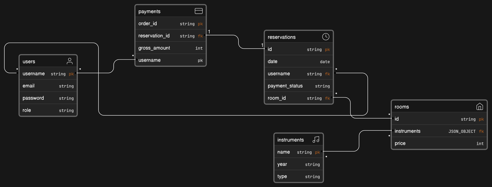

# Go Studio Music
Go Studio Music adalah platform reservasi studio musik yang memungkinkan pengguna untuk melakukan pemesanan studio musik dengan mudah. Platform ini menyediakan berbagai fitur dan layanan melalui API yang telah Anda buat, termasuk:

1.  **Pemesanan Studio Musik:** Pengguna dapat menggunakan API untuk melakukan pemesanan studio musik. Mereka dapat mengirim permintaan pemesanan dengan detail seperti tanggal, waktu, dan jenis studio yang diinginkan.

2.  **Email Konfirmasi:** Pengguna akan menerima email konfirmasi pemesanan yang berisi nomor pesanan. Email ini akan dikirim otomatis setelah konfirmasi pemesanan.
3. **Akses ke Informasi Instrument:** Pengguna dapat melihat list dari instrument atau alat musik yang tersedia.
4. **Akses ke Informasi Ruangan:** Pengguna dapat melihat list dari ruangan yang ada beserta dengan instrumentnya.
    
5.  **Akses ke Informasi Reservasi:** API ini memungkinkan pengguna untuk mengakses informasi reservasi mereka, termasuk nomor pesanan, tanggal dan waktu pemesanan, dan studio yang dipesan.
    
6.  **Notifikasi Pembayaran:** Pengguna akan menerima notifikasi pembayaran yang berisi token pembayaran yang dapat digunakan untuk melakukan konfirmasi pembayaran.  

## Tech Stack

- Framework : Echo, Firebase cloud messaging
- DB : Firebase
- Deployment : Google Cloud Platform (GCP)
- Code Structure : Clean Architecture
- Unit Testing : Testify(80)%, mockery
- Authentication : JWT
- AI implementation : room recommendation based on genre and rooms data
- Payment Gateway : Midtrans

## MVP

[Go-Music-Studio](https://docs.google.com/document/d/1LgpJc4Cw-1L6M8Li6s5YeBLCZ7kvMuAwIEnFGZ99R6o/edit)

## API Documentation

[Go-Music-Studio](https://www.postman.com/joint-operations-participant-55966296/workspace/go-studio-music/documentation/29105484-4189ad0e-2fb3-424f-93f3-a074907021a8)

## ERD

